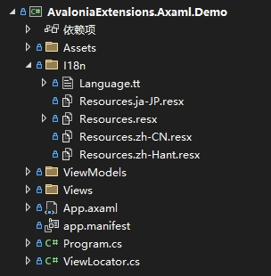

# AvaloniaExtensions

English | [简体中文](README.zh-CN.md)

A syntactic sugar library that brings convenience to Avalonia UI development, aiming to enhance development efficiency and experience by providing additional functionality and simplifying common operations.

## 安装

```bash
Install-Package AvaloniaExtensions.Axaml
```

## I18n

**Format Requirements**: Create an `I18n` directory in your project and create multilingual resource files `Resources[.xx].resx` within it as needed. For example, create `Resources.resx`, `Resources.zh-CN.resx`, and `Resources.ja-JP.resx` for English, Simplified Chinese, and Japanese. The demo structure is as follows:



It is recommended to use ResX Manager to edit resource files for easier management of multilingual resources:


You can use a T4 template file (such as `Language.tt` in the demo) to automatically generate C# code for resource keys for easy referencing in your project:

```tt
<#@ template debug="false" hostspecific="true" language="C#" #>
<#@ assembly name="System.Core" #>
<#@ assembly name="System.Xml" #>
<#@ assembly name="System.Xml.Linq" #>
<#@ import namespace="System.Linq" #>
<#@ import namespace="System.Text" #>
<#@ import namespace="System.Collections.Generic" #>
<#@ import namespace="System.Xml.Linq" #>
<#@ import namespace="System.IO" #>
<#@ output extension=".cs" #>
//------------------------------------------------------------------------------  
// <auto-generated>  
//     This code was generated by a tool.  
//     Changes to this file may cause incorrect behavior and will be lost if  
//     the code is regenerated.  
// </auto-generated>  
//------------------------------------------------------------------------------
<#
    const string ResourceFileName = "Resources.resx";
#>

namespace <#=System.Runtime.Remoting.Messaging.CallContext.LogicalGetData("NamespaceHint").ToString()#>;

public static class Language
{
<#
    var resourceKeys = XElement.Load(this.Host.ResolvePath(ResourceFileName))
        .Elements("data")
        .Select(item => item.Attribute("name")?.Value)
        .Where(item => item != null);

	var resourceDesignerName = Path.GetFileNameWithoutExtension(ResourceFileName);

    foreach (string resourceKey in resourceKeys)
    {
#>
	public static readonly string <#= resourceKey #> = "<#= resourceKey #>";
<#
    }
#>
}
```

Generated C# code example:

```csharp
public static class Language
{
	public static readonly string AppName = "AppName";
	public static readonly string Welcome = "Welcome";
}
```

**Usage**:

- Static binding of resource keys:

```axaml

<TextBlock Text="{i18n:I18n {x:Static l:LanguageKeys.Welcome}}" />
```

- Dynamic binding of resource keys:

```axaml
<TextBlock Text="{i18n:I18n {Binding Title}}" />
```

- Switching languages:

```csharp
I18nManager.Instance.Culture = new CultureInfo(language);
```

## Thanks

Taken from open source, contributed to open source. The development of this library was inspired and aided by the following open-source projects or articles:

- WpfExtensions: [https://github.com/DingpingZhang/WpfExtensions](https://github.com/DingpingZhang/WpfExtensions)
- I18N：[https://github.com/Antelcat/I18N](https://github.com/Antelcat/I18N)
- WPF或Avalonia使用tt模板和resx文件实现国际化：[https://blog.csdn.net/eyupaopao/article/details/136638194](https://blog.csdn.net/eyupaopao/article/details/136638194)

Special thanks to the contributors of these projects. Their efforts have provided valuable references and assistance for the development of AvaloniaExtensions.
