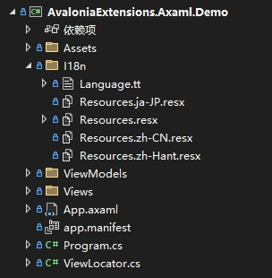
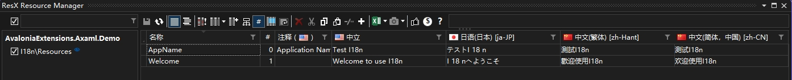

# AvaloniaExtensions

简体中文 | [English](README.md)

为Avalonia UI开发带来便利的语法糖库，旨在通过提供额外的功能和简化常用操作，提升开发效率与体验。

## 安装

```bash
Install-Package AvaloniaExtensions.Axaml
```

## I18n

**格式要求**： 在项目中创建`I18n`目录，并在其中创建需要支持的多语言资源文件`Resources[.xx].resx`。例如，为英语、简体中文、日语创建`Resources.resx`和`Resources.zh-CN.resx`、`Resources.ja-JP.resx`。参考Demo结构如下：



推荐使用ResX Manager进行资源文件编辑，以更便捷地管理多语言资源：



可使用T4模板文件（如Demo中的`Language.tt`）自动生成资源键的C#代码，以便在项目中引用：

```tt
<#@ template debug="false" hostspecific="true" language="C#" #>
<#@ assembly name="System.Core" #>
<#@ assembly name="System.Xml" #>
<#@ assembly name="System.Xml.Linq" #>
<#@ import namespace="System.Linq" #>
<#@ import namespace="System.Text" #>
<#@ import namespace="System.Collections.Generic" #>
<#@ import namespace="System.Xml.Linq" #>
<#@ import namespace="System.IO" #>
<#@ output extension=".cs" #>
//------------------------------------------------------------------------------  
// <auto-generated>  
//     This code was generated by a tool.  
//     Changes to this file may cause incorrect behavior and will be lost if  
//     the code is regenerated.  
// </auto-generated>  
//------------------------------------------------------------------------------
<#
    const string ResourceFileName = "Resources.resx";
#>

namespace <#=System.Runtime.Remoting.Messaging.CallContext.LogicalGetData("NamespaceHint").ToString()#>;

public static class Language
{
<#
    var resourceKeys = XElement.Load(this.Host.ResolvePath(ResourceFileName))
        .Elements("data")
        .Select(item => item.Attribute("name")?.Value)
        .Where(item => item != null);

	var resourceDesignerName = Path.GetFileNameWithoutExtension(ResourceFileName);

    foreach (string resourceKey in resourceKeys)
    {
#>
	public static readonly string <#= resourceKey #> = "<#= resourceKey #>";
<#
    }
#>
}
```

生成的C#代码示例：

```csharp
public static class Language
{
	public static readonly string AppName = "AppName";
	public static readonly string Welcome = "Welcome";
}
```

**使用方式**：

- 静态绑定资源键：

```axaml

<TextBlock Text="{i18n:I18n {x:Static l:LanguageKeys.Welcome}}" />
<TextBlock Text="{markup:I18n {x:Static l:Language.RunningCountInfo},Win10}" />
```

- 动态绑定资源键：

```axaml
<TextBlock Text="{i18n:I18n {Binding Title}}" />
```

- 切换语言：

```csharp
I18nManager.Instance.Culture = new CultureInfo(language);
```

## If

在AXAML中使用条件表达式

```axaml
<TextBlock Text="{markup:If Condition={Binding Status}, True=已运行, False=未运行}" />
<TextBlock Text="{markup:If {Binding Status}, {markup:I18n {x:Static l:Language.Running}}, {markup:I18n {x:Static l:Language.NotRunning}}}" />
```

## 扩展转换器

### IfConditionConverter

```axaml
<markup:IfConditionConverter x:Key="StatusConditionConverter">
            <markup:IfConditionConverter.True>
                <TextBlock Foreground="Green" Text="{markup:I18n {x:Static l:Language.Running}}" />
            </markup:IfConditionConverter.True>
            <markup:IfConditionConverter.False>
                <TextBlock Foreground="DarkOrange" Text="{markup:I18n {x:Static l:Language.NotRunning}}" />
            </markup:IfConditionConverter.False>
        </markup:IfConditionConverter>
```

```axaml
<ContentControl Content="{Binding Status, Converter={StaticResource StatusConditionConverter}}" />
```

## 感谢

取之于开源，献之于开源。本库的开发受到了以下开源项目或文章的启发与帮助：

- WpfExtensions: [https://github.com/DingpingZhang/WpfExtensions](https://github.com/DingpingZhang/WpfExtensions)
- I18N：[https://github.com/Antelcat/I18N](https://github.com/Antelcat/I18N)
- WPF或Avalonia使用tt模板和resx文件实现国际化：[https://blog.csdn.net/eyupaopao/article/details/136638194](https://blog.csdn.net/eyupaopao/article/details/136638194)

特别感谢这些项目的贡献者，他们的努力为AvaloniaExtensions的开发提供了宝贵的参考与帮助。
